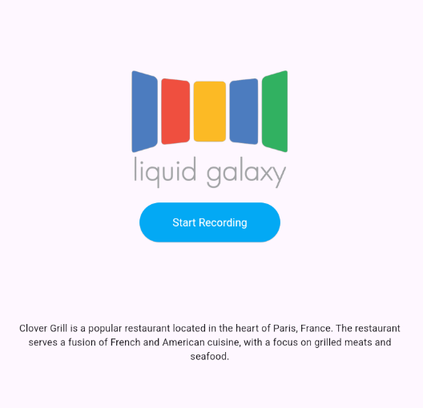

# LG-AI-Voice-Flutter

A sample app to demonstrate the voice-to-voice feature for Liquid Galaxy applications.

### Usage

This demo app utilizes Deepgram's speech-to-text and text-to-speech features for the voice transcriptions as well as Groq to process the user's question via Google's `gemma2-9b-it` model. The app takes in a prompt to a location the user is interested in and navigates to the location on Liquid Galaxy as well as gives a response via voice for the user to listen to. In the screenshot below, I asked "What is the best restaurant in Paris?". The LLM via Groq returned the coordinates of the location as well as the response to the question to give a visual and a vocal aspect.

